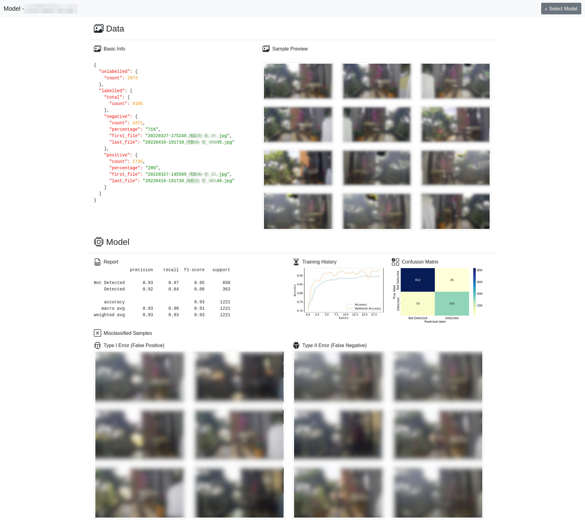

# Tensorflow Pipeline

A framework built to be a component in a pipeline of data processing using `Tensorflow`.

This framework is used to:
* utils.py
  * Initialize GPU settings.
  * Read labelled data from upstream data providers.
  * Preprocess data and split them into a training set and a validation set.
* train.py
  * Load model configurations and train the model.
  * Save model summary and model plot to filesystem.
  * Save the model to filesystem for future use.
* eval.py
  * Evaluate the model with the validation set.
  * Save the visualization of diagnostics.
* predict.py
  * Provide an interface for downstream data users to call the model for prediction.
  * Save predictions to a JSON file.

Note that this repo is a pipeline framework only and data augmentation and 
model construction are **not** included: they are dynamically loaded to the
pipeline according to the path defined in the `config.json` file.

## Model Dashboard

The final project's dashboard incorporating this tensorflow pipeline looks like this.

(But sure the dashboard is mainly a frontend project which is beyond the scope
of this repository as well)